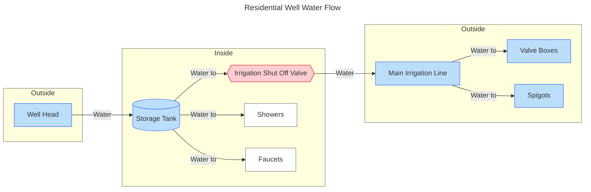

# Irrigation using a residential well

```mermaid
---
title: Residential Well Water Flow
config: {}
---
flowchart LR
 subgraph O1["Outside"]
        A["Well Head"]
  end
 subgraph I1["Inside"]
        B[("Storage Tank")]
        F{{"Irrigation Shut Off Valve"}}
        D["Showers"]
        E["Faucets"]
  end
 subgraph O2["Outside"]
        G["Main Irrigation Line"]
        H["Valve Boxes"]
        I["Spigots"]
  end
    A -- Water --> B
    B -- Water to --> F & D & E
    F -- Water --> G
    G -- Water to --> H & I
    style A fill:#BBDEFB,stroke:#2962FF
    style B fill:#BBDEFB,stroke:#2962FF
    style F fill:#FFCDD2,stroke:#D50000
    style D fill:#FFFFFF,stroke:#757575
    style E fill:#FFFFFF,stroke:#757575
    style G fill:#BBDEFB,stroke:#2962FF
    style H fill:#BBDEFB,stroke:#2962FF
    style I fill:#BBDEFB,stroke:#2962FF
    style I1 stroke:#757575
    style O1 stroke:#757575
    style O2 stroke:#757575
```
